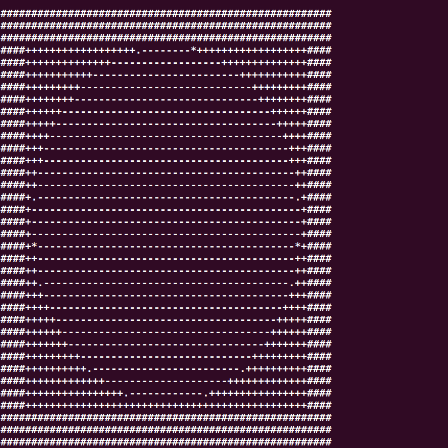

# ASCII-art

## Description
This Project will take an image and print out an [ASCII-art](https://en.wikipedia.org/wiki/ASCII_art).

## About this Project
This project uses [opencv](https://www.opencv.org) to process images and [numpy](https://numpy.org) to manipulate arrays. The Image is numerically coded for different threshold regions it comes under and for each coded regions, a symbol is used for printing it out in the stdout.

## Usage
Use the Script [art.py](https://github.com/AlekyaOntela11/Python_Codes/ASCII/art.py).
In the command line, Enter

Replace the `https://github.com/AlekyaOntela11/Python_Codes/ASCII/sample_image.png` with the image you want to do ascii. By default it takes

## Customization
There are two things you can customize in [art.py]

* `symbols_list`
* `threshold_list`

Modify the threshold list to take **different threshold values** thereby changing the patterns in the printed image.
Modify the symbols list to substitute **different symbols** in the coded patterns.

## Sample
Input Image :

Output :

